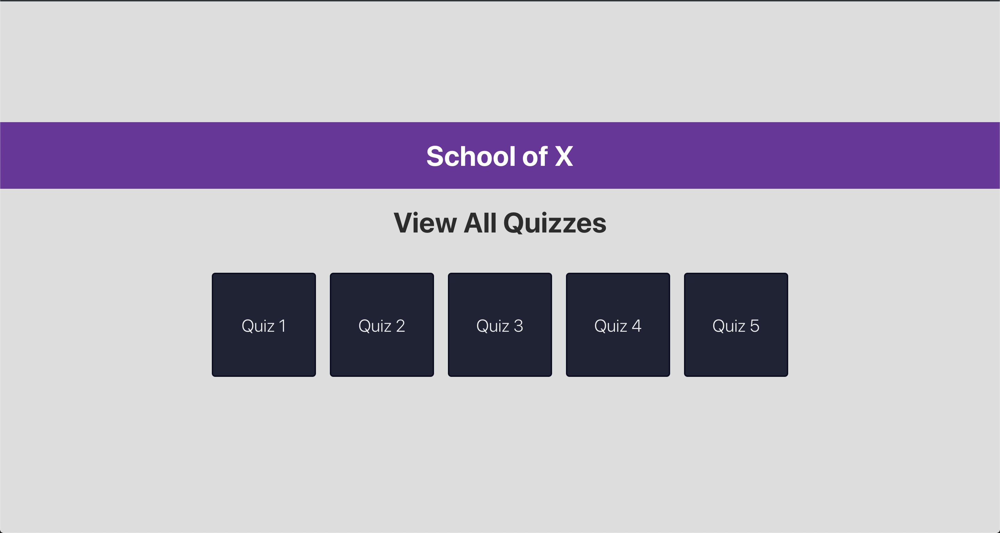
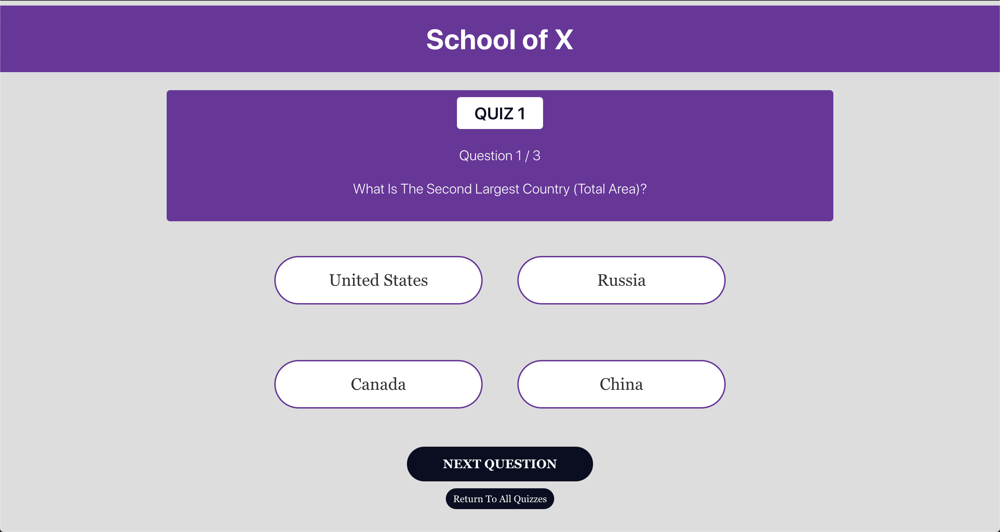
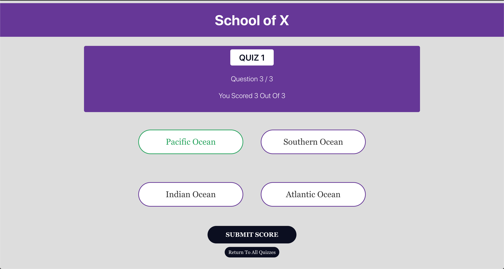

## Install

This project uses [node](http://nodejs.org), [npm](https://npmjs.com) and [gatsby](https://www.gatsbyjs.org/). You will need to have them locally installed to run this project.

Clone this Repo: 

```
$ git clone https://github.com/DeclanBoller/code-test-client.git
```

Run NPM Install: 

```
$ npm install 
```

Run Gatsby Development Server

```
$ gatsby develop
```

## Screens:

### All Quizzes - 
  

### Quiz - 
  

### Submission - 
  
